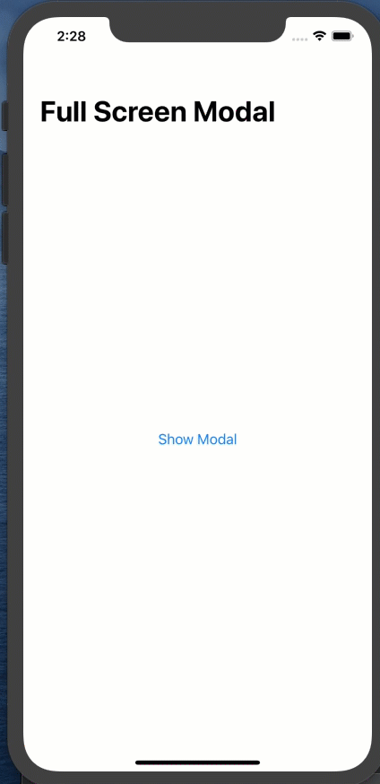
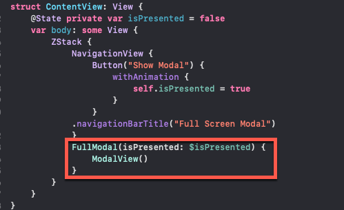

# Fullscreen Modal - SwiftUI

Credit for this idea and goes to Brian Voon of Lets' Build That App tutorials.  Idea came from this video tutorial

https://www.youtube.com/watch?v=514A7yzznJE&t=579s

If you don't already subscribe, you should.  Great stu

To present a fullscreen modal, 

1. Embed your entire content inside a ZStack.  This also includes embedding your NavigationView if you have one.
2. Create a @State variable that will be toggled by some action that will result in the full modal being presented.
3.   The magic will happen as the second view of your newly created ZStack



```swift
struct ContentView: View {
    @State private var isPresented = false
    var body: some View {
        ZStack {
            NavigationView {
                Button("Show Modal") {
                    withAnimation {
                        self.isPresented = true
                    }
                }
            .navigationBarTitle("Full Screen Modal")
            }
            // This is where the magic will happen
            }
        }
    }
}
```


## The FullModal Struct

The FullModal struct uses a ViewBuilder that will take in the state variable as a @Binding and your custom modal view as a closure.  You can use the following and modify as required.  The background here is White and it has a close button on the top right.  This is a reusable struct so I suggest that you place it in its own file.

```swift
struct FullModal<Content:View>: View {
    @Binding var isPresented:Bool
    let modalView: () -> Content
    let thisWindow = UIApplication.shared.windows.filter{$0.isKeyWindow}.first
    var body: some View {
        ZStack {
            Color(UIColor.secondarySystemBackground)
            VStack {
                HStack {
                    Spacer()
                    Button(action: {
                        withAnimation {
                            self.isPresented = false
                        }
                    }) {
                        Image(systemName:"xmark.circle.fill")
                    }
                }
                .padding(.horizontal)
                modalView()
            }.padding(.top,thisWindow?.safeAreaInsets.top)
            Spacer()
        }
        .offset(x: 0, y: isPresented ? 0 : thisWindow?.frame.height ?? 0)
        .edgesIgnoringSafeArea(.all)
    }
}

```

Once you have that struct in place, you can create your own unique content to serve as the modal view itself.

## Custom Modal View

You custom modal view is basically any view you want to present.  The only caveat is that you should embed it in a VStack with a Spacer() as the last view.  This will force the close button of the FullModal wrapper to be placed at the top of the presented modal.

For example:

```swift
struct ModalView: View {
    var body: some View {
        VStack {
          
            RoundedRectangle(cornerRadius: 10)
                .fill(Color.green)
                .frame(width: 200, height: 200)
            Spacer()
        }
    }
}
```


Now, back in your original view, you can replace the `// This is where the magic will happen`with a call to the FullModalView, passing in your State variable and your custom modal view as the closure.

Here is what my original ContentView now looks like



That is all there is to it.